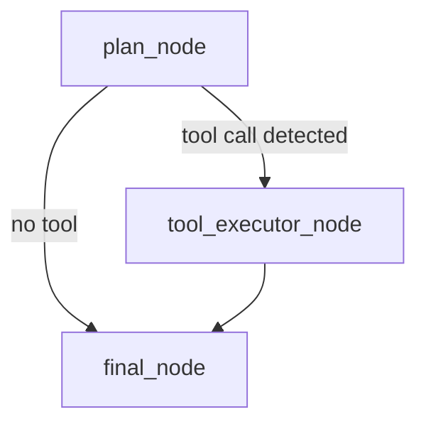

# 🤖 ReAct Agent with LangGraph | Day 8 Part 2

A fully functional ReAct agent using **LangGraph**, with:
- 🔁 Tool use planning + execution (`ReAct` style)
- 🧠 FAISS-powered memory (MiniLM embeddings)
- 🧰 Real tools: `calculator`, `wikipedia`, `file_search`
- 💬 Local LLM (Gemma 2B via Ollama)
- 🎛️ Streamlit UI with memory preview and dark theme

---

## 🚀 Features

| Feature               | Status | Description |
|----------------------|--------|-------------|
| LangGraph Core       | ✅     | Used for stateful graph execution |
| Local LLM            | ✅     | Gemma 2B via Ollama |
| Local Embeddings     | ✅     | `sentence-transformers/all-MiniLM-L6-v2` |
| Memory (FAISS)       | ✅     | Vector-based memory with auto store/retrieve |
| ReAct Tool Format    | ✅     | Supports `Action: tool_name[query]` |
| Streamlit UI         | ✅     | Dark theme, input/output display, memory logs |
| Tools Implemented    | ✅     | Calculator, Wikipedia, File Search |
| Tool Router          | ✅     | Unified function to dispatch tool queries |
| Invalid Tool Handling| ✅     | Tool validation with user feedback |

---

## 🧠 Tool Usage Format

Agent recognizes tool calls ONLY in this strict format:

```text
Action: calculator[3 + 5]
Action: wikipedia[LangGraph]
Action: file_search[neural networks]
```

Incorrect formats (e.g., `Tool: Wikipedia[LangGraph]`) will be rejected.

---

## 📁 Project Structure

```bash
day08_react_agent/
├── agent_graph.py       # LangGraph state machine
├── tools.py             # Calculator, Wikipedia, File Search, Router
├── local_llm.py         # Chat wrapper for Ollama Gemma 2B
├── memory.py            # FAISS memory manager
├── react_agent.py       # CLI runner
├── ui.py                # Streamlit app
├── requirements.txt     # Dependencies
├── README.md            # You're reading it!
```

---

## 🖥️ Streamlit UI

Run with:

```bash
streamlit run day08_react_agent/ui.py
```

### ✅ Features:
- Cyberpunk dark theme
- Input + response view
- Tool call logs
- FAISS memory preview below chat
- Smart refresh (no repeated memory context)
- Optional voice input (coming soon)

---

## 🛠️ Setup Instructions

1. Create and activate a Python environment:
   ```bash
   python -m venv venv
   source venv/bin/activate  # or venv\Scripts\activate on Windows
   ```

2. Install dependencies:
   ```bash
   pip install -r requirements.txt
   ```

3. Make sure FAISS and SentenceTransformers are available.

4. Install Ollama + Gemma 2B model:
   ```bash
   ollama run gemma:2b
   ```

---

## ▶️ Run Agent in CLI

```bash
python day08_react_agent/react_agent.py
```

---

## 🧠 Agent Architecture (LangGraph)



---

## ✨ Example Interaction

```
User: What is the capital of France?
🧠 Memory: nothing relevant
🧠 Tool Call: Action: wikipedia[France]
✅ Result: The capital of France is Paris.
```

---

## 💾 Persistent Memory

- FAISS memory is stored on disk (`faiss_store/`)
- All chat messages from Human/AI are embedded and stored
- Automatically retrieved based on cosine similarity for new queries

---

## 🧪 Tools Implemented

| Tool        | Description                               |
|-------------|-------------------------------------------|
| calculator  | Safely evaluates arithmetic expressions   |
| wikipedia   | Summarizes topic using Wikipedia library  |
| file_search | Searches for a keyword in `documents/`    |

---

## 🧩 Dependencies

```text
langgraph
langchain
faiss-cpu
sentence-transformers
wikipedia
streamlit
ollama
```

---

## 🧑‍💻 Author

Kapil | AIDS Engineering Student  
Building GenAI tools using LangGraph, local models, and FastAPI.

---

## 🔗 License

MIT License (Free to use, modify, share)
