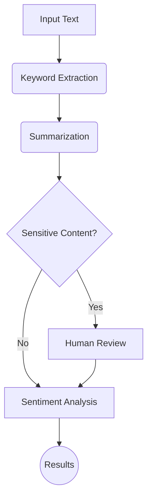

# Document Analysis Bot with LangGraph & Ollama


An advanced document processing pipeline with local LLMs using Ollama (Gemma 2B). It performs:

- ✅ Keyword Extraction
- ✂️ Summarization
- 🚨 Sensitive Content Detection
- 😀 Sentiment Analysis

## 🔧 Features

- **Modular Graph Architecture** via LangGraph
- **Private LLM Execution** (Gemma 2B via Ollama)
- **State Persistence & Resumability**
- **Manual Review for Sensitive Content**
- **Confidence Scoring**

## 📊 Flow Diagram



## 🚀 Quickstart

### Prerequisites

```bash
# Install Ollama and pull model
curl -fsSL https://ollama.com/install.sh | sh
ollama pull gemma:2b
```

### Setup

```bash
python -m venv venv
source venv/bin/activate  # Linux/macOS
venv\Scripts\activate   # Windows
pip install -r requirements.txt
```

### Run

```python
from analyzer import process_document

results = process_document("Confidential report on financial data", thread_id="doc_123")
```

Or use CLI:

```bash
python cli.py --text "Document text here" --save-results
```

## ⚙️ Configuration

Edit `config.yaml`:

```yaml
llm:
  model: gemma:2b
  temperature: 0.3

processing:
  sensitive_terms: [confidential, ssn, password]
```


## ✅ Output Example

```json
{
  "keywords": ["confidential", "report", "financial"],
  "summary": "Sensitive financial details covered.",
  "sentiment": {"label": "neutral", "confidence": 0.72},
  "review_status": "approved"
}
```


## 🤝 Contributing

1. Fork and branch
2. Commit → Push → PR

## 📄 License

MIT License — See `LICENSE`.