# 🧠 Corrective RAG (CRAG) Agent with LangGraph


---

## 📌 Overview

This project implements a **CRAG (Corrective Retrieval-Augmented Generation)** agent using **LangGraph**.

It is an advanced RAG system capable of:
- Retrieving documents from Tavily
- Automatically grading retrieval quality
- Looping with retry/fallbacks
- Rewriting queries when needed
- Merging ambiguous feedback
- Generating a final answer based on evaluated content

This agent simulates a **self-correcting knowledge agent** that evaluates its own retrieval results and improves them in context.

---

## 🧠 Architecture

```mermaid
graph TD
    Start([🟢 user_input])
    Start --> Retriever
    Retriever --> Grader
    Grader -->|grade: correct| FinalContext
    Grader -->|grade: incorrect| Correction
    Grader -->|grade: ambiguous| AmbiguousMerge
    Correction --> Rerun
    Rerun --> RetryRouter{retry_count >= 3?}
    RetryRouter -->|Yes| Answer
    RetryRouter -->|No| Grader
    AmbiguousMerge --> Grader
    FinalContext --> Answer
```



---

## 🧩 Node Descriptions

| Node | Purpose |
|------|---------|
| `user_input` | Accepts question input |
| `retriever` | Retrieves top-3 documents using Tavily |
| `grading` | Grades the quality of retrieved docs |
| `correction` | Suggests improved query |
| `rerun_retrieval` | Re-fetches with updated query |
| `ambiguous_merge` | Merges feedback with original docs |
| `final_context_merge` | Compiles final docs into a prompt |
| `answer_node` | Generates final response using Gemma |

---

## 🔧 Tech Stack

- 💬 **LangGraph** (0.4.8)
- 🧱 **LangChain** + `langchain_ollama`
- 🔍 **TavilySearch** tool
- 🧠 **Local LLM (Gemma 2B)** via Ollama
- 🧪 **CRAG Looping Logic**
- 🔁 Retry limits, ambiguity handling
- 📊 Optional: **LangSmith Observability**

---

## 🚀 How to Run

### 1. Setup

```bash
# Create and activate virtualenv
python3 -m venv langgraph-env
source langgraph-env/bin/activate

# Install dependencies
pip install langgraph langchain langchain_ollama langchain_tavily
```

### 2. Install and Start Ollama (if not already)

```bash
# Install Ollama: https://ollama.com
ollama run gemma:2b
```

### 3. Set API Keys

```bash
export TAVILY_API_KEY=your_tavily_key
export LANGCHAIN_API_KEY=your_langsmith_key  # optional
```

### 4. Run the agent

```bash
python day13_crag_agent/agent_graph.py
```

---

## 📊 Example Output

```json
{
  "grade": "correct",
  "feedback": "The provided text clearly defines quantum computing...",
  "answer": "Quantum computing is a computational technique that harnesses..."
}
```

---

## 🧠 Learnings

This project showcases:
- Conditional branching with LangGraph
- Self-evaluation & retry logic (CRAG)
- Prompt-based retrieval improvement
- Merged context answer synthesis

---

## 🔗 Repo

GitHub: [kapil3771/langchain-langgraph-journey](https://github.com/kapil3771/langchain-langgraph-journey)

---

## 👨‍💻 Author

**Kapil** – BTech AIDS Engineer | GenAI Developer  